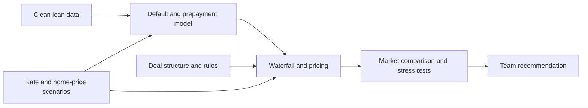

# Pricing GSE Credit Risk Transfer Notes — STACR 2026-DNA1

UC Berkeley MFE · MFE230M Asset Securitization (ABSM) · Fall 2026 · Final Project, **Track 2**
**Instructor:** Professor Nancy Wallace, UC Berkeley Haas School of Business

**Team:** Al Yazid Bensaid, Coco Ma, Smarajit Paul Choudhury, Haocheng Sun, Reza Zamani

## Objective
Analyze and price Freddie Mac STACR 2026-DNA1 (classes A-1, M-1, M-2) from the
perspective of a consultant advising prospective investors, with Fannie Mae
CAS 2026-R01 as a comparison deal.

| Class | Amount | Rule 144A CUSIP | Reg S CUSIP |
|---|---|---|---|
| A-1 | $275.9mm | 35564UCQ8 | U3202CCQ1 |
| M-1 | $275.9mm | 35564UCR6 | U3202CCR9 |
| M-2 | $75.7mm  | 35564UCS4 | U3202CCS7 |

## Project map (Track 2 requirements)
| Requirement | Where |
|---|---|
| 1. Organizational structure | `docs/structure.md` |
| 2. Cash flow structure (collateral + notes) | `docs/cashflows.md`, `src/waterfall.py` |
| 3a. Price the collateral (reference pool) | `src/collateral.py`, `src/scenarios.py` |
| 3b. Price the tranches | `src/waterfall.py`, `src/pricing.py` |
| 4. Recommendations | `report/` |

## Pipeline
```
data/raw → clean.py → collateral.py + scenarios.py → waterfall.py → pricing.py → report
```

## Team workstreams

| Owner | Workstream | Main responsibilities |
|---|---|---|
| Reza Zamani | Deal structure | Document the transaction parties, credit protection, tranche structure, waterfall rules, triggers, and bankruptcy remoteness |
| Haocheng Sun | Loan-data pipeline | Clean and validate the loan-level data, document transformations, and produce pool-model inputs |
| Al Yazid Bensaid | Default and prepayment model | Model defaults, prepayments, severity, and timing under the agreed scenarios |
| Smarajit Paul Choudhury | Waterfall and pricing | Allocate cash flows and losses, price the tranches, and compare modeled spreads with the market |
| Coco Ma | Economic scenarios | Develop interest-rate and home-price paths for base, upside, downside, and stress cases |



See [`PROJECT_PLAN.md`](PROJECT_PLAN.md) for ownership, handoffs, integration standards, and completion criteria.

## Data (NOT committed)
Bloomberg loan-level files and course historical data are licensed and must stay
local. Place them in `data/raw/`:
- `STACR_2026_DNA1_A1_Loan_Level.xlsx`
- `CAS_2026_R01_2A1_Loan_level.xlsx`
- historical performance data for model calibration

## Setup
```bash
python -m venv .venv && source .venv/bin/activate
pip install -r requirements.txt
python -m src.clean      # writes data/processed/*.parquet
pytest                   # run tests
```

## Deliverables
- Oral presentation: 5–8 slides (`report/slides/`)
- Written summary: 5–10 pages, slides in appendix (`report/`)
