# Pricing GSE Credit Risk Transfer Notes — Freddie Mac STACR 2026-DNA1

UC Berkeley MFE · MFE230M Asset Securitization (ABSM) · Fall 2026 · Final Project
**Instructor:** Professor Nancy Wallace, UC Berkeley Haas School of Business
**Team:** Al Yazid Bensaid, Coco Ma, Smarajit Paul Choudhury, Haocheng Sun, Reza Zamani

---

## Contents

1. [Purpose](#1-purpose)
2. [Research questions](#2-research-questions)
3. [Hypotheses](#3-hypotheses)
4. [The deal](#4-the-deal)
5. [Data](#5-data)
6. [Methodology](#6-methodology)
7. [Project parts and team](#7-project-parts-and-team)
8. [Results: tables](#8-results-tables)
9. [Results: figures](#9-results-figures)
10. [Conclusion and recommendations](#10-conclusion-and-recommendations)
11. [Limitations and open items](#11-limitations-and-open-items)
12. [Repository layout](#12-repository-layout)
13. [How to reproduce](#13-how-to-reproduce)
14. [Deliverables](#14-deliverables)

---

## 1. Purpose

Freddie Mac's STACR (Structured Agency Credit Risk) notes transfer mortgage **credit risk**
from Freddie Mac to private investors. Investors do not buy mortgages. They buy floating-rate
notes (SOFR + spread) issued by a trust, and their principal is written down if loans in a
**reference pool** of Freddie Mac mortgages suffer losses.

The project acts as a consultant advising prospective investors in **STACR 2026-DNA1**,
classes **A-1, M-1 and M-2** (M-2A and M-2B). We:

1. describe the organizational structure and investor protections;
2. lay out the cash-flow rules (the waterfall) for the collateral and the notes;
3. project the reference pool under economic scenarios and price the notes; and
4. give recommendations by investor type.

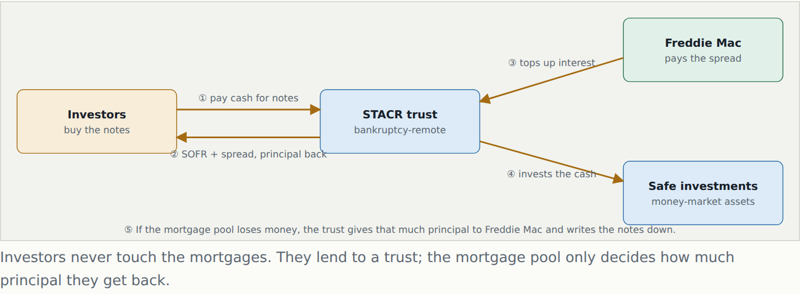

## 2. Research questions

| # | Question |
|---|---|
| Q1 | How is the deal organized, and what protects investors (bankruptcy remoteness, subordination, triggers)? |
| Q2 | How fast will the reference pool prepay and how much will it lose, under different house-price and interest-rate paths? |
| Q3 | Do those losses reach the offered classes (A-1, M-1, M-2), and if not, what is the main risk to investors? |
| Q4 | What are the notes' weighted average lives (WALs) and prices across scenarios and discount margins? |
| Q5 | Do the model's WALs and prices agree with Bloomberg, and is each class cheap or rich? |
| Q6 | Which investors should own which class? |

## 3. Hypotheses

| # | Hypothesis | Verdict |
|---|---|---|
| H1 | The pool is high quality (FICO ~760, current LTV ~70) and has built equity, so losses to the call stay well under 1% of the cut-off balance even in a 2008-style house-price fall. | **Supported.** Losses are 0.20%–0.37% of cut-off across scenarios. |
| H2 | The 1.90% of subordination below M-2B absorbs all projected losses, so the offered classes take no write-down. | **Supported.** Zero write-down for A-1, M-1, M-2A and M-2B in all four scenarios. |
| H3 | Because borrowers pay ~6.76% while market rates are ~7.3%, prepayments are slow and the main risk is **extension**, not credit loss. | **Supported.** Year-1 CPR is 7.6%–10.9%; M-1 and M-2 WALs extend by about a year in the moderate case. |
| H4 | Because the notes float over SOFR, prices stay near par when the discount margin equals the coupon spread, and value changes come mainly from timing. | **Supported.** Price ≈ 100.10 (par + ~0.10 accrued) for every class at its own spread. |
| H5 | The model's principal timing and pricing are consistent with the market. | **Supported, with a timing gap for M-2.** Bloomberg WALs fall inside our scenario range; A-1 and M-1 match our base case, while the market prices M-2A and M-2B closer to our moderate (slower) case. |

## 4. The deal

Source: Private Placement Memorandum (PPM), February 12, 2026, and Capital Contribution
Agreement, February 17, 2026 (`docs/reference/`). Full write-ups: `docs/structure.md` (Part 1)
and `docs/cashflows.md` (Part 2).

| Item | Value |
|---|---|
| Issuer | Freddie Mac STACR REMIC Trust 2026-DNA1 (Delaware statutory trust) |
| Sponsor | Freddie Mac |
| Closing date | February 17, 2026 |
| Reference pool at cut-off | $22.78bn, 64,434 loans |
| Reference pool on the September 2026 tape (our start) | $19.25bn, 56,433 loans |
| Offered notes | $627.5mm (A-1, M-1, M-2A, M-2B), Rule 144A / Reg S |
| Optional call (assumed exercised) | February 2031 payment date, or when the pool falls to 10% of cut-off |
| Loss basis | Actual loss: UPB + missed interest + costs − sale proceeds − mortgage insurance |

**Capital stack.** Each class sits beside a Freddie-retained "H" piece, and losses hit from the bottom up.

| Class | Original | Current (Sept 2026) | Spread (SOFR +) | Attach – detach (% of cut-off) | Held by |
|---|---|---|---|---|---|
| A-H | $21.69bn | $18.36bn | — | 4.80 – 100 | Freddie Mac |
| A-1 (+A-1H) | $275.9mm | $203.5mm | 85 bp | 3.525 – 4.80 | Investors (144A CUSIP 35564UCQ8) |
| M-1 (+M-1H) | $275.9mm | $157.8mm | 100 bp | 2.25 – 3.525 | Investors (35564UCR6) |
| M-2A (+M-2AH) | $37.85mm | $37.85mm | 130 bp | 2.075 – 2.25 | Investors |
| M-2B (+M-2BH) | $37.85mm | $37.85mm | 130 bp | 1.90 – 2.075 | Investors (M-2: 35564UCS4) |
| B-1H | $102.5mm | $102.5mm | 180 bp | 1.45 – 1.90 | Freddie Mac |
| B-2H | $273.4mm | $273.4mm | 475 bp | 0.25 – 1.45 | Freddie Mac |
| B-3H | $57.0mm | $57.0mm | — | 0 – 0.25 | Freddie Mac (first loss) |

Original amounts are the offered class only; attachment points include the paired H piece.

**Investor protections.** The trust is a separate, limited-purpose entity with a non-petition
covenant. Note proceeds sit in short-term government assets. Freddie Mac retains the first-loss
B pieces and a vertical slice of every class. Three **triggers** decide whether subordinate
classes receive principal: the Minimum Credit Enhancement Test (Subordinate Percentage ≥ 3.525%),
the Cumulative Net Loss Test and the Delinquency Test. If any fails, all principal goes to the
senior classes. A-1 also has a fixed fast-pay schedule for its first 36 payments while its own
cumulative-loss test (≤ 1.00%) holds.

**Pool profile (September 2026 tape, balance-weighted).** Coupon 6.76% (market 7.28%); FICO 759;
original LTV 75.6 (all loans 61–80, no mortgage insurance); current LTV 70.5; DTI 38.5; loan age
18 months; 30+ days delinquent 0.79% of balance.

**Losses fill the stack from the bottom.** Heights are to scale; the shaded part is the severe
scenario's total loss.

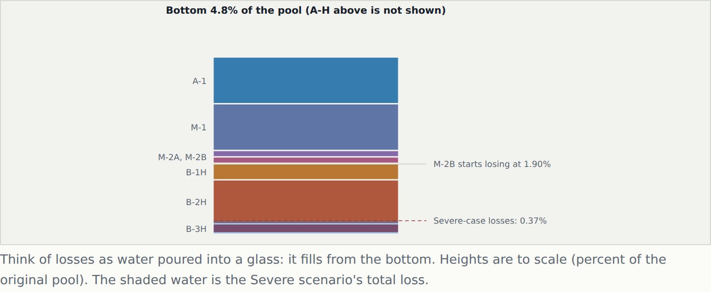

## 5. Data

| Data | Source | Use | In repo? |
|---|---|---|---|
| STACR 2026-DNA1 loan-level tape, post-September 2026 (56,433 loans, $19,254,307,537.76) | Freddie Mac Clarity disclosure converted to the Bloomberg layout; matches Bloomberg CLP and the M-1 September factor | Starting pool | Yes: `data/raw/STACR_2026_DNA1_A1_Loan_Level_2026-09.xlsx` |
| STACR 2026-DNA1 loan-level tape, post-August 2026 (56,871 loans) | Bloomberg | Earlier snapshot, kept for reference | Yes: `data/raw/STACR_2026_DNA1_A1_Loan_Level.xlsx` |
| Freddie Mac Single-Family Loan-Level Dataset, sample files, 27 vintages | Freddie Mac | Calibrating prepayment, default and severity | No: too large for GitHub (download from Freddie Mac) |
| FHFA purchase-only HPI (`HPIPONM226S`), PMMS 30-year rate (`MORTGAGE30US`) | FRED | Mark-to-market LTV, refinance incentive | Yes: `data/raw/*.csv` |
| SOFR, Fed funds, 2y and 10y Treasuries (with HPI and PMMS) | FRED | Scenario generation, SOFR coupons | No: `python -m src.scenarios --download` saves them to `data/market/` |
| Bloomberg market data as of October 2, 2026: DES, PDI, CLP and CFT screens; bid/ask prices, discount margins, WALs, factors and ratings by class | Bloomberg, collected by Haocheng Sun | Validating balances, WALs and prices ([§8.3](#83-validation-against-bloomberg)) | Yes: `data/bloomberg_validation/` |
| PPM and Capital Contribution Agreement | Freddie Mac | Deal rules | `docs/reference/` |
| Class factors, September 2026 | Bloomberg, validated by Haocheng Sun | Current class balances | Constants in `src/waterfall.py` |

Files expected locally:

```
data/raw/STACR_2026_DNA1_A1_Loan_Level_YYYY-MM.xlsx   # in the repo; the newest dated tape is used
data/raw/HPIPONM226S.csv, data/raw/MORTGAGE30US.csv   # in the repo
data/raw/freddie_sf/sample_orig_YYYY.txt              # not in the repo (too large)
data/raw/freddie_sf/sample_perf_YYYY.txt              # not in the repo (too large)
data/market/*.csv                                      # created by src.scenarios --download
```

Result tables, figures and pool cash flows are committed as well.

## 6. Methodology

```
 data/raw ─► clean ─► calibrate ─► scenarios ─► project pool ─► waterfall ─► price
             src/       src/          src/          src/              src/          src/
             clean.py   calibration   scenarios.py  collateral_       waterfall.py  pricing.py
                        .py, freddie  (Coco)        projection.py     (Smarajit)    (Smarajit)
                        .py           (Reza)        (Reza)
```

### 6.1 Data cleaning (`src/clean.py`)
Load the newest STACR tape, standardize fields, compute balance-weighted pool statistics and
write `data/processed/*.parquet`.

### 6.2 Prepayment model (`src/prepayment.py`)
CPR is a seasoning ramp times a base turnover rate plus an S-curve in refinance incentive
(borrower coupon minus PMMS), less burnout:

`CPR = ramp × [turnover + refi_max × S(coupon − PMMS) − burnout]`,  `SMM = 1 − (1 − CPR)^(1/12)`

Fitted: turnover 5.5%, maximum refinance add-on 41.4%, S-curve midpoint 0.71 pp of incentive,
seasoning ramp about 6 months.

Prepayments come on top of **scheduled principal**, which is small early in a loan's life:

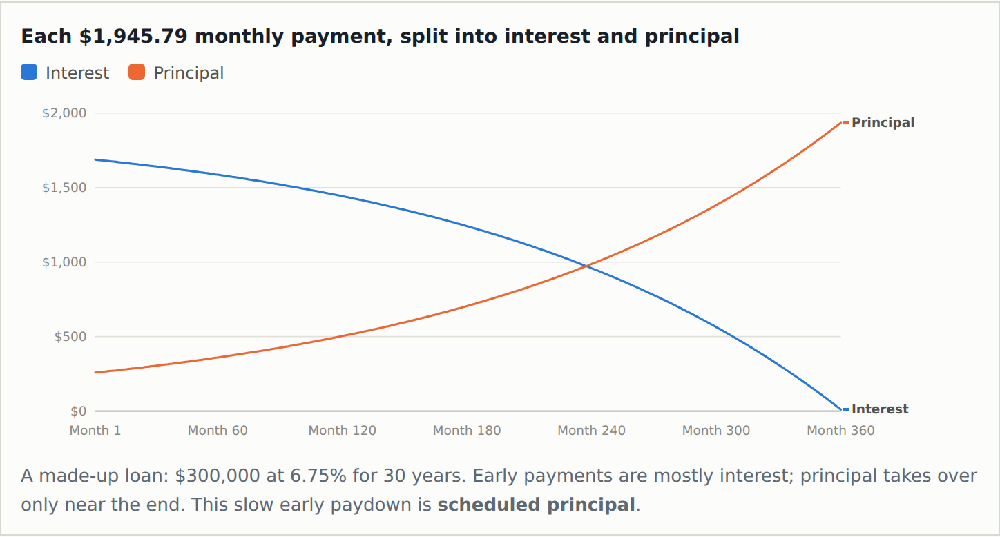

### 6.3 Default and severity model (`src/credit_model.py`)
- **Credit events:** Poisson GLM for the monthly default rate on mark-to-market LTV (piecewise,
  steeper above 80), FICO, DTI, investor status, recent 30-day delinquency and a pre-2009
  vintage dummy. Mark-to-market LTV moves with the scenario house-price index.
- **Liquidation pipeline:** a defaulted loan stays in the pool as distressed for about 19 months
  (fitted median time to credit event) before it becomes a credit event with a loss. Loans
  already 60+ days delinquent on the tape start in the pipeline. No cures (conservative).
- **Severity:** built from the sale itself: UPB + ~19 months of missed interest + ~10% costs −
  proceeds at a fitted 48% distressed-sale discount to HPI value − mortgage insurance. Severity
  rises as house prices fall.
- **Modifications:** 57% of distressed loans are modified with a 0.57 pp rate cut. The lost
  interest is passed to the waterfall as `modification_losses`.

### 6.4 Calibration (`src/calibration.py`, `src/freddie.py`)
Fit on 27 vintages of the Freddie Mac SF loan-level sample with FRED PMMS and HPI. Prepayment by
least squares on CPR by incentive bucket; defaults by Poisson GLM with a loan-month exposure
offset; severity by UPB-weighted least squares on 17,389 actual liquidations (from 22,598
default spells). Parameters: `outputs/tables/fitted_params.csv`.

### 6.5 Scenarios (`src/scenarios.py`, Coco Ma)
Five monthly factors (short rate, 2y and 10y Treasury, mortgage–10y spread, HPI growth) follow
AR(1) processes fitted on 2000–2026 data. 20,000 paths are simulated with a 6-month block
bootstrap of joint residuals, from the October 3, 2026 valuation date to the February 2031 call.

| Scenario | Construction | HPI change to 2031 | Mortgage rate at call |
|---|---|---|---|
| good | mean of simulated paths in the 75th–85th HPI percentile | +32% | 5.67% |
| base | mean of paths in the 45th–55th HPI percentile | +22% | 5.79% |
| moderate | historical replay Dec 2005 – May 2010, re-anchored to today's rates | −14% | 5.90% |
| severe | historical replay Mar 2007 – Aug 2011 (2008-style crash) | −21% | 5.39% |

Outputs: `data/scenarios/scenarios.csv` (mortgage rate and HPI by month) and
`data/scenarios/pricing_rates.csv` (SOFR coupon fixings and discount factors).

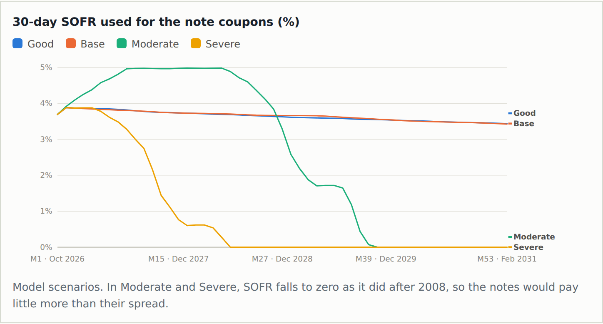

### 6.6 Collateral projection (`src/collateral_projection.py`, `src/export_results.py`)
Each month, in order: defaults (default rate × performing balance), scheduled amortization,
then prepayments (SMM × remaining balance). Output per scenario, months 1–53
(`outputs/tables/pool_cf_<scenario>.csv`): beginning balance, scheduled principal,
prepayments, credit events, losses, modification losses, distressed balance and ending
balance. Column definitions: `outputs/HANDOFF_SMARAJIT.md`.

### 6.7 Waterfall (`src/waterfall.py`, `src/run_waterfall_pricing.py`, Smarajit Paul Choudhury)
Implements the PPM rules from payment 8 onward: bottom-up loss allocation with each offered
class paired with its H piece; modification losses interest-first; senior/subordinate principal
split by the triggers; the A-1 reduction schedule and post-payment-36 priority; Recovery
Principal on defaults; and the February 2031 call. Starting trigger history uses Bloomberg CLP
delinquency data. Details: `docs/waterfall_pricing.md`.

**Worked example, base month 9.** A $23.31mm credit-event loss lands in B-3H only, and the
trigger gate decides how that month's principal is split:

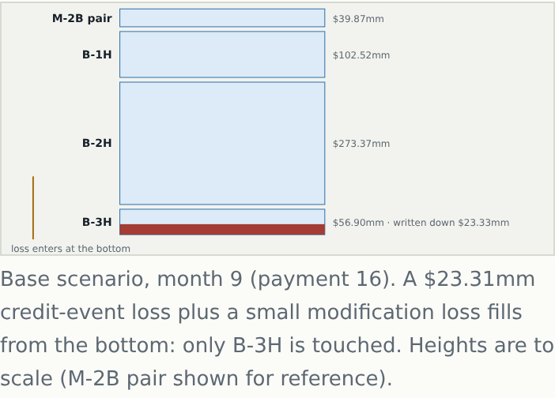

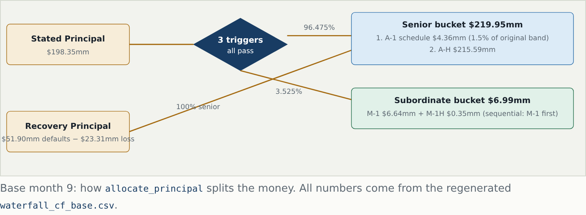

The Subordinate Percentage sits exactly on the 3.525% minimum while the triggers pass. Each
loss pushes it below the line, and all principal then goes senior until it climbs back:

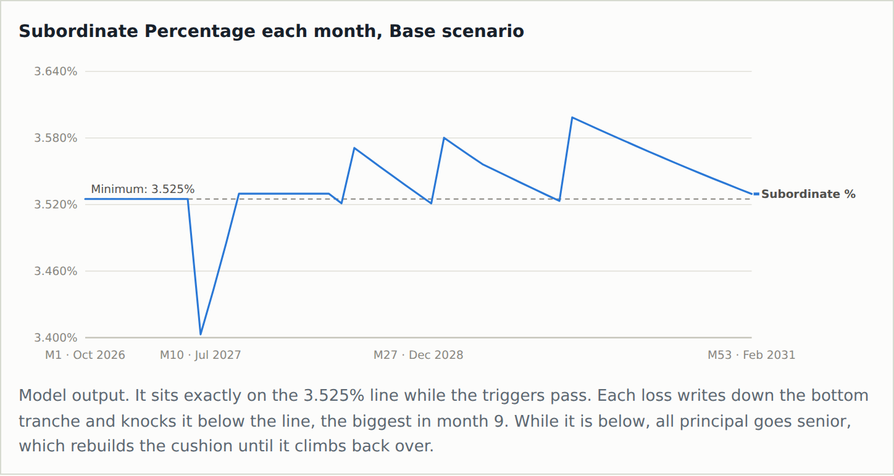

### 6.8 Pricing (`src/pricing.py`)
Each class's monthly cash flows per 100 face are discounted at the scenario's SOFR path plus a
discount margin (DM). Prices are full (dirty) prices including ~0.10 of accrued interest since
September 25, 2026. We report WAL and prices at DM = 0, 100 and 200 bp and at DM = the class
spread.

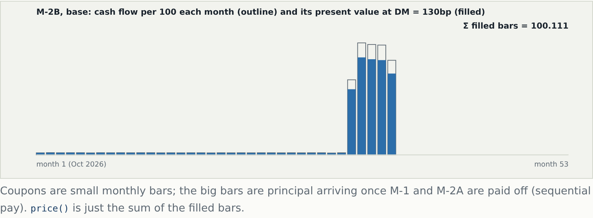

Given a market price, the discount margin is found by bisection on the price function:

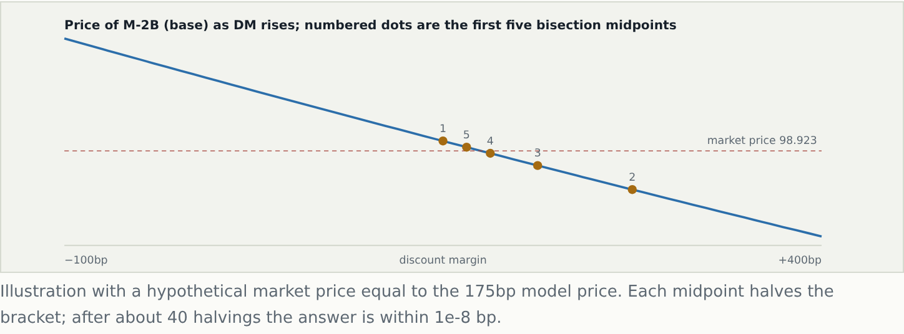

## 7. Project parts and team

| Part | Owner | Main files |
|---|---|---|
| 1–2. Deal structure and cash-flow rules | Al Yazid Bensaid | `docs/structure.md`, `docs/cashflows.md` |
| Loan data cleaning, class factors, and final validation | Haocheng Sun | `src/clean.py`, `notebooks/01_clean.ipynb`, `docs/validation.md`, `tests/test_output_validation.py`, `data/bloomberg_validation/` |
| 3a. Default and prepayment model, calibration, pool projection | Reza Zamani | `src/prepayment.py`, `src/credit_model.py`, `src/calibration.py`, `src/freddie.py`, `src/collateral_projection.py`, `src/export_results.py`, `notebooks/02_prepayment_and_credit_model.ipynb`, `notebooks/03_collateral_projection.ipynb`, `notebooks/04_model_functions_walkthrough.ipynb`, `notebooks/05_calibration_results.ipynb`, `notebooks/06_freddie.ipynb`, `notebooks/07_calibration_step_by_step.ipynb`, `notebooks/08_export_results.ipynb` |
| Rate and house-price scenarios | Coco Ma | `src/scenarios.py`, `src/market_data.py`, `data/scenarios/` |
| 2–3b. Waterfall and pricing | Smarajit Paul Choudhury | `src/waterfall.py`, `src/pricing.py`, `src/run_waterfall_pricing.py` |
| 4. Recommendations, report and slides | Team | `report/` |

**Notebooks** (`notebooks/`, with `.py` copies in `notebooks/scripts/`). Every code cell has a
markdown note above (what it does) and below (what it shows), plus Q&A.

| Notebook | Content |
|---|---|
| `01_clean` | Load and clean the STACR loan tape |
| `02_prepayment_and_credit_model` | CPR/SMM, credit-event rate and severity functions |
| `03_collateral_projection` | Monthly pool projection by scenario |
| `04_model_functions_walkthrough` | Each model function step by step |
| `05_calibration_results` | Fitted prepayment, default and severity parameters |
| `06_freddie` | Freddie Mac loan-level calibration data |
| `07_calibration_step_by_step` | Calibration walked through one step at a time |
| `08_export_results` | Run all scenarios and export tables and figures |

## 8. Results: tables

All tables are in `outputs/tables/`.

### 8.1 Reference pool by scenario (`scenario_summary.csv`)

| Scenario | Year-1 CPR | Pool at call | Prepayments | Credit events | Losses | Losses (% of cut-off) | Avg severity |
|---|---|---|---|---|---|---|---|
| good     | 10.9% | $6.83bn | $11.51bn | $122mm | $46.4mm | 0.20% | 38% |
| base     | 10.6% | $7.33bn | $10.98bn | $124mm | $50.3mm | 0.22% | 41% |
| moderate |  7.6% | $9.30bn |  $8.89bn | $136mm | $68.6mm | 0.30% | 50% |
| severe   |  8.0% | $7.17bn | $11.10bn | $149mm | $84.6mm | 0.37% | 57% |

Every scenario starts from the same $19.25bn pool. The worst-case loss (0.37%) uses about a
fifth of the 1.90% subordination below M-2B.

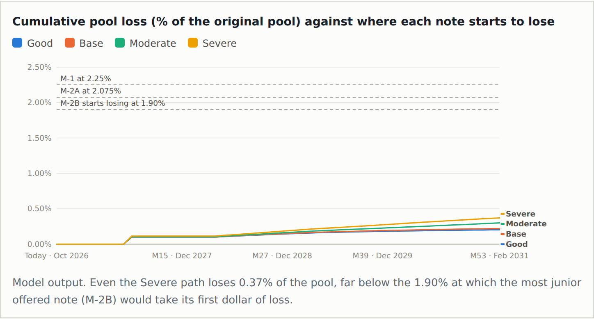

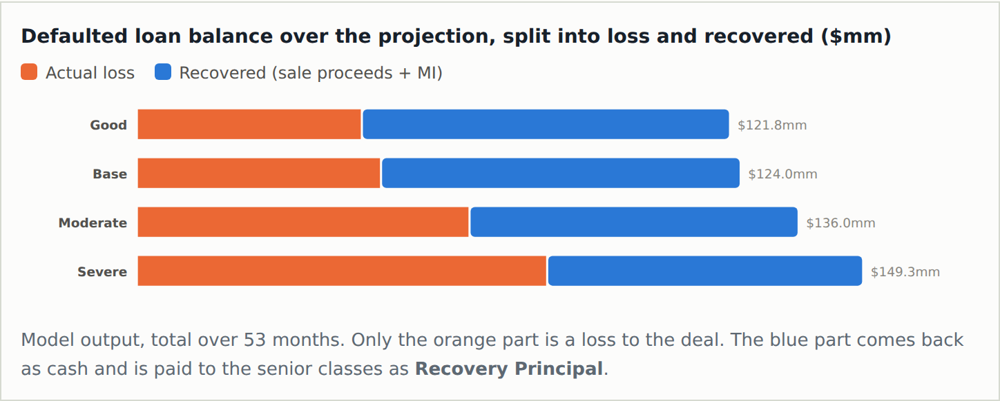

### 8.2 Offered classes by scenario (`tranche_pricing_summary.csv`)

**WAL (years from the September 2026 payment)**

| Class | good | base | moderate | severe | PPM at issue |
|---|---|---|---|---|---|
| A-1  | 1.40 | 1.40 | 1.40 | 1.40 | 1.59 |
| M-1  | 1.16 | 1.20 | 1.87 | 1.54 | 1.75 |
| M-2A | 2.28 | 2.43 | 3.47 | 2.74 | 4.11 |
| M-2B | 2.70 | 2.82 | 3.84 | 3.16 | 4.79 |

Our WALs start from September 2026, so they are shorter than the PPM's issue-date WALs.

- **Write-downs:** zero for every offered class in every scenario.
- **Final principal payment:** A-1 in month 30 in every scenario; M-2B between month 35 (good)
  and month 49 (moderate).

**Base-case prices (full price per 100)**

| Class | DM 0 bp | DM 100 bp | DM 200 bp | DM = own spread |
|---|---|---|---|---|
| A-1  | 101.26 | 99.90  | 98.57 | 100.10 |
| M-1  | 101.28 | 100.10 | 98.95 | 100.10 |
| M-2A | 103.16 | 100.81 | 98.51 | 100.11 |
| M-2B | 103.63 | 100.91 | 98.27 | 100.11 |

These are sensitivities, not market prices. Longer classes (M-2B) move most per 100 bp of DM.
All four scenarios are in the CSV.

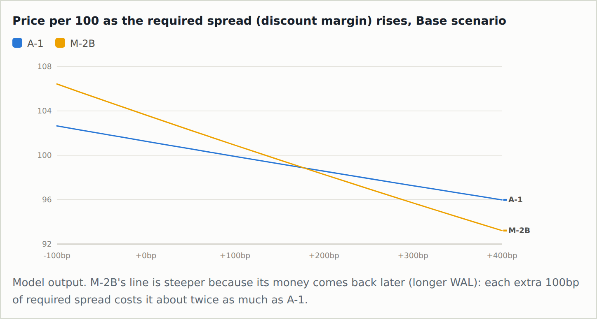

**Paydown and extension.** Sequential pay retires A-1 and M-1 first; in the moderate scenario
M-2B's paydown is pushed out by about a year:

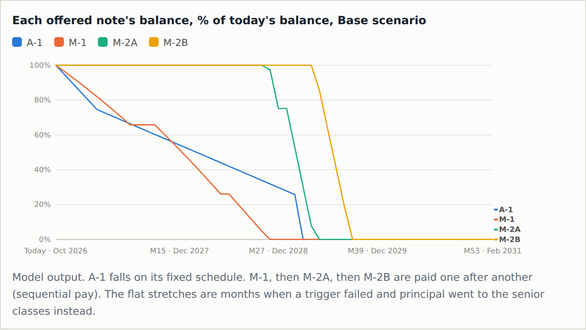

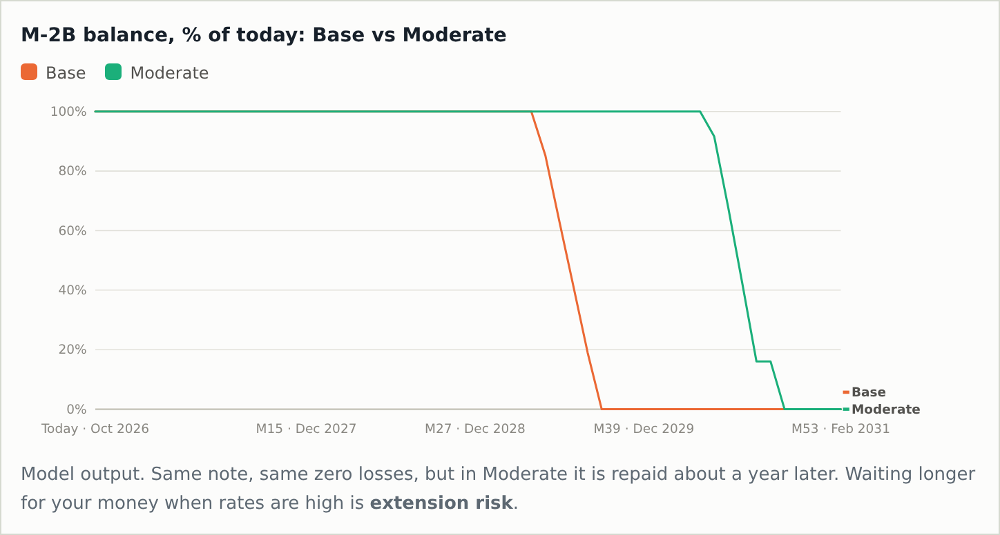

### 8.3 Validation against Bloomberg

Haocheng Sun ran a final validation of the saved outputs (`docs/validation.md`).

**Output checks** (`tests/test_output_validation.py`, 16 tests, all passing). For every scenario,
the tests check that:
- the pool roll-forward reconciles (`ending = beginning − scheduled − prepayments − defaults`)
  and starts from the September pool of $19,254,307,537.76;
- every tranche's balance reconciles month to month, with no negative balances;
- no offered class is written down;
- M-1 starts at the September balance of $157,810,518.32, and the starting Subordinate
  Percentage is at least 3.525%;
- prices fall as the discount margin rises, and WALs are between 0 and 5 years.

**Model vs. market** (Bloomberg, October 2, 2026; `data/bloomberg_validation/STACR_2026-DNA1_Bloomberg_Market_Data_2026-10-02.xlsx`)

| Class | Current factor | Bloomberg WAL | Our WAL: base (range across scenarios) | Bloomberg bid / ask | Ask DM | Coupon spread | DM on our base cash flows at the ask | Same, moderate |
|---|---|---|---|---|---|---|---|---|
| A-1  | 0.7375 | 1.39 | 1.40 (1.40–1.40) | 99.844 / 99.978  | 87 bp  | 85 bp  | 87 bp  | 87 bp  |
| M-1  | 0.5720 | 1.23 | 1.20 (1.16–1.87) | 99.875 / 100.027 | 98 bp  | 100 bp | 98 bp  | 99 bp  |
| M-2A | 1.0000 | 2.78 | 2.43 (2.28–3.47) | 99.377 / 99.720  | 141 bp | 130 bp | 142 bp | 139 bp |
| M-2B | 1.0000 | 3.48 | 2.82 (2.70–3.84) | 98.761 / 99.148  | 157 bp | 130 bp | 162 bp | 154 bp |

"DM on our cash flows" is the discount margin that makes our projected cash flows worth the
Bloomberg ask price (plus ~0.10–0.11 of accrued interest), using Coco's SOFR path.

- **Balances match.** Bloomberg factors and balances equal the ones the waterfall uses for every
  class. (One sheet in the Bloomberg workbook still flags M-1 against an older $164.13mm
  balance; the repository already uses the correct $157.81mm.)
- **Timing is in range.** Every Bloomberg WAL falls inside our scenario range. A-1 and M-1 match
  our base case. For M-2A and M-2B, Bloomberg's WAL is longer than our base case and close to our
  moderate case, so the market is pricing in slower paydown than our base projection.
- **A-1 and M-1 trade at their coupon spread** (ask DM 87 and 98 bp vs. 85 and 100 bp), priced
  near par.
- **M-2A and M-2B trade wider than their 130 bp coupon** (ask DM 141 and 157 bp), at a discount.
  On our base cash flows, buying M-2B at the ask earns about 162 bp, roughly 5 bp more than
  Bloomberg's figure, because we expect it to pay back sooner at par. On our moderate cash flows
  it earns 154 bp. The extra spread compensates for extension risk, not credit risk: no scenario
  writes M-2 down.

### 8.4 Calibration tables

| File | Content |
|---|---|
| `fitted_params.csv` | Prepayment and credit parameters: placeholder vs. fitted |
| `calibration_prepay_by_incentive.csv` | Observed vs. fitted CPR by refinance-incentive bucket |
| `calibration_default_glm.csv` | Poisson GLM coefficients, standard errors and z-statistics |
| `calibration_default_by_ltv.csv`, `calibration_default_by_fico.csv`, `calibration_default_by_dti.csv` | Observed default rates by risk bucket |
| `calibration_severity_by_ltv.csv` | Observed vs. fitted severity by LTV |
| `calibration_pipeline_summary.csv` | Time to credit event, liquidation and modification shares |

### 8.5 Cash-flow tables

| File | Content |
|---|---|
| `pool_cf_<scenario>.csv` | Monthly reference-pool cash flows (collateral → waterfall handoff) |
| `scenario_paths_used.csv` | Scenario paths used in the projection |
| `waterfall_cf_<scenario>.csv`, `waterfall_cashflows_all.csv` | Monthly interest, principal, write-downs and trigger states for every class |

## 9. Results: figures

All figures are in `outputs/figures/`.
The `codebook_*.png` charts come from the STACR DNA1 Codebook (`stacr-codebook.html`), a
companion page Smarajit Paul Choudhury built for this repo; they use the same September-tape outputs.

| Figure | What it shows |
|---|---|
| `08_2_plot_the_scenario_paths.png` | Mortgage-rate and HPI paths for the four scenarios |
| `02_figure_1_cpr_vs_refinancing_incentive.png` | Prepayment S-curve: CPR against refinance incentive |
| `02_figure_2_credit_event_rate_by_scenario.png` | Monthly credit-event rate by scenario |
| `03_figure_3_projected_reference_pool_balance.png` | Projected pool balance to the call |
| `08_5_project_the_pool_project_collateral_run_scenarios.png` | Pool cash flows across scenarios |
| `05_2_market_inputs_pmms_rate_and_house_prices.png` | PMMS rate and house-price history |
| `05_3_prepayment_fit.png` | Calibration: observed vs. fitted CPR |
| `05_4_default_fit_poisson_glm.png` | Calibration: default GLM fit |
| `05_5_liquidation_pipeline_timing_outcomes_30_day_roll.png` | Time to credit event and outcomes of delinquent loans |
| `05_6_severity_fit.png` | Calibration: observed vs. fitted severity |
| `01_3_distributions_that_drive_your_model.png` | Pool distributions that drive the model |
| `04_*.png`, `06_*.png`, `07_*.png` | Step-by-step model and calibration walk-throughs |
| `codebook_01` … `codebook_14` | Teaching and result charts from Smarajit Paul Choudhury's STACR DNA1 Codebook page, embedded in the sections above: money flow, tranche stack, scheduled principal, SOFR paths, month-9 loss and principal split, Subordinate Percentage, M-2B cash flows, DM bisection, cumulative loss vs. attachment, defaults vs. recoveries, price vs. DM, note balances, M-2B extension |

**Scenario paths**

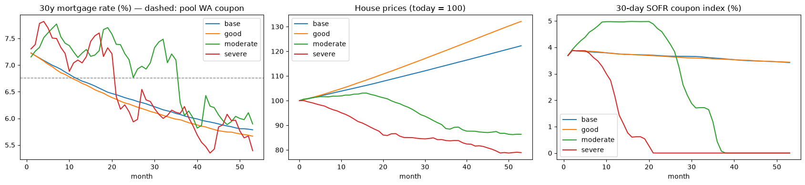

**Prepayment S-curve**

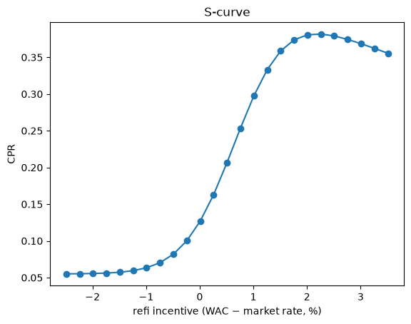

**Credit-event rate by scenario**

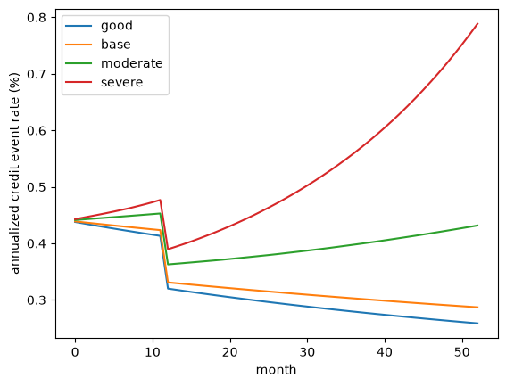

**Projected reference pool balance**

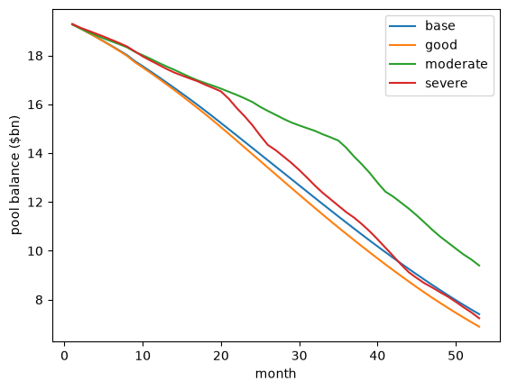

## 10. Conclusion and recommendations

1. **Credit risk to the offered notes is remote.** Projected pool losses of 0.20%–0.37% of
   cut-off are absorbed by the 1.90% of Freddie-retained B pieces. No offered class is written
   down even when house prices fall 21%. M-2B would need about five times our worst-case loss
   before it lost principal.
2. **Extension is the real risk.** The pool is out of the money (6.76% coupon vs. 7.28% market),
   so it prepays slowly. In the moderate scenario, where prices fall and rates stay high, M-1
   extends from 1.2 to 1.9 years and M-2B from 2.8 to 3.8 years. The severe scenario extends
   less because rates fall further and refinancing picks up.
3. **The market agrees on credit and prices extension.** Bloomberg balances match ours and its
   WALs fall inside our scenario range. A-1 and M-1 trade at their coupon spreads, close to par.
   M-2A and M-2B trade 11–27 bp wider than their 130 bp coupon, with Bloomberg WALs near our
   moderate case. On our base case M-2B is slightly cheap (about 162 bp earned at the ask vs.
   157 bp quoted); on our moderate case it is roughly fair.

**By investor type (draft):**
- **A-1:** short, stable 1.4-year WAL in every scenario thanks to its fixed pay-down schedule.
  Suits bank and money-market-style buyers who want SOFR floaters with little extension.
- **M-1:** modest extension risk, the highest-quality mezzanine class. Suits insurers and asset
  managers looking for extra spread with no projected loss.
- **M-2A / M-2B:** the most spread (130 bp coupon, 141–157 bp at the market ask) with the most
  extension (up to 3.8 years) and price sensitivity. Suits investors who can hold through slower paydown, such as total-return credit
  funds and hedge funds.

## 11. Limitations and open items

- **The Minimum Credit Enhancement test fails after losses.** The Subordinate Percentage starts
  exactly at the 3.525% minimum, so any loss that writes down a B piece fails the test until
  senior-only principal rebuilds the cushion. The largest failure is months 10–12 in every
  scenario: the tape's existing 60+ day delinquent loans (about $52mm) are all liquidated
  together in month 9, the midpoint of the 19-month pipeline, producing a ~$23mm loss in B-3H.
  Later losses cause shorter failures (base: months 21, 28 and 38; moderate and severe: more
  often). This is how the PPM test works, but the single month-9 lump comes from our
  simplification of liquidating the starting pipeline on one date; spreading those
  liquidations over time would likely smooth it. Notes saying the triggers pass throughout
  (including `docs/validation.md`, which checks month 1 only) are out of date.
- Supplemental Reduction Amount and the Offered Reference Tranche Percentage test are not
  implemented. None of the four scenarios reaches them before payoff or the call.
- The market comparison uses one Bloomberg snapshot (October 2, 2026) and Bloomberg's own
  prepayment and SOFR assumptions; the Bloomberg historical-price exports (`*_HP_*.xlsx`) came
  back empty, so there is no price history.
- `tests/test_scenarios.py` needs the FRED files in `data/market/`; run
  `python -m src.scenarios --download` first or those tests error.
- No cures from the liquidation pipeline, and house prices are national rather than regional.
- Results assume the February 2031 call is exercised.

## 12. Repository layout

```
├── data/
│   ├── raw/                  # STACR loan tapes, FRED HPI and PMMS (Freddie SF files stay local)
│   ├── processed/            # cleaned tape (gitignored)
│   ├── scenarios/            # Coco's scenario paths, pricing rates, diagnostics
│   └── bloomberg_validation/ # Bloomberg screens and market data, October 2, 2026
├── docs/             # structure.md, cashflows.md, waterfall_pricing.md, validation.md, reference PDFs
├── notebooks/        # 01–08, plus notebooks/scripts/*.py
├── outputs/
│   ├── tables/       # all result CSVs
│   ├── figures/      # all PNG figures
│   └── pool_cf_*.parquet, HANDOFF_SMARAJIT.md
├── report/           # written-summary outline and slides
├── src/              # model code
└── tests/            # pytest suite
```

## 13. How to reproduce

```bash
python -m venv .venv && source .venv/bin/activate
pip install -r requirements.txt

python -m src.clean                   # 1. clean the loan tape              -> data/processed/
python -m src.scenarios --download    # 2. rate and HPI scenarios            -> data/scenarios/
# 3. calibrate: run notebook 05 (or 07)                                     -> data/processed/freddie/
python -m src.export_results          # 4. project the pool, tables, figures -> outputs/
python -m src.run_waterfall_pricing   # 5. waterfall and pricing             -> outputs/tables/
pytest                                # all tests
pytest -q tests/test_output_validation.py   # final output validation only
```

Step 1 uses the loan tape in `data/raw/`. Steps 3 and 4 also need the Freddie Mac SF sample
files, which are not in the repository. Step 5 and the output validation tests run from the
committed `outputs/tables/`, so they work from a fresh clone.

## 14. Deliverables

- Oral presentation: 5–8 slides (`report/slides/`)
- Written summary: 5–10 pages, slides in an appendix (`report/`, outline in `report/outline.md`)
